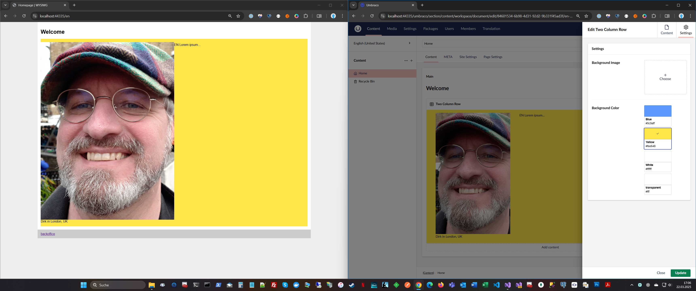
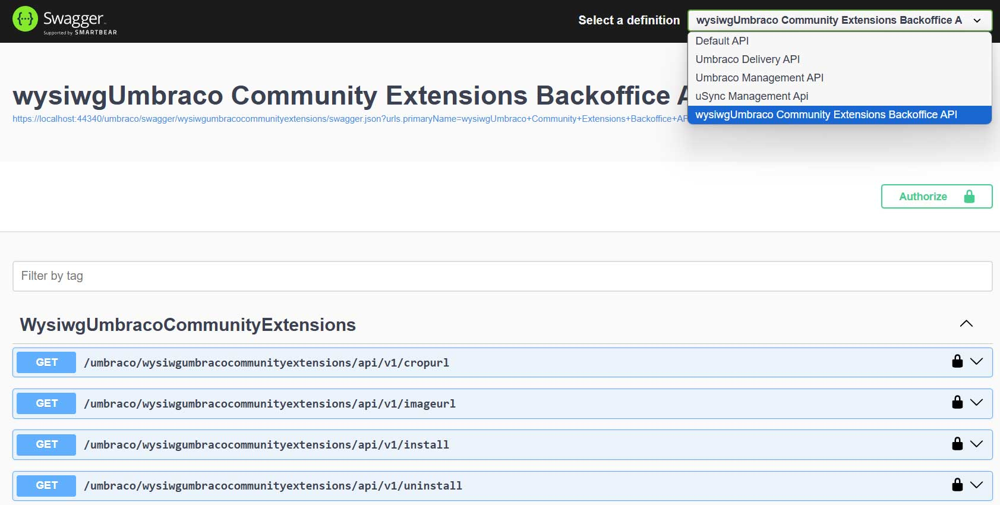
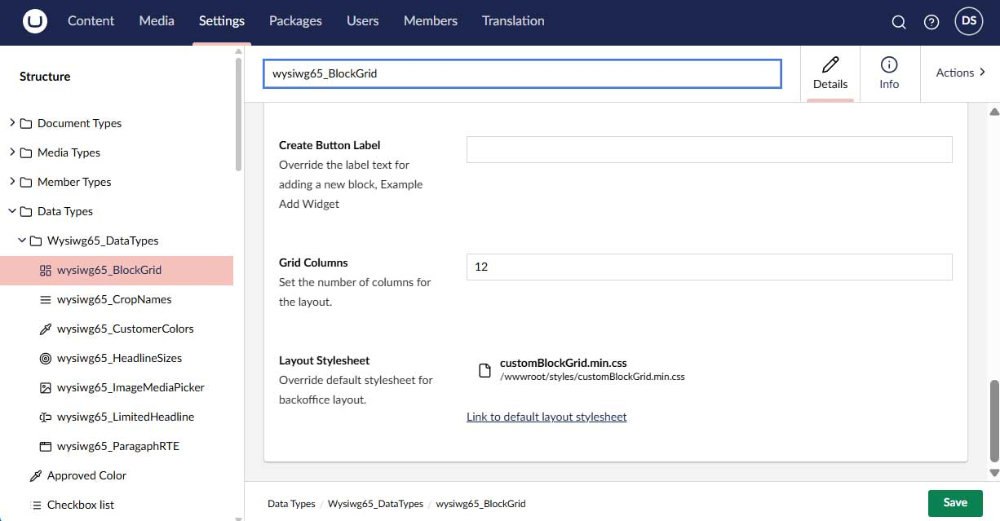

# wysiwgUmbracoCommunityExtensions

[](https://www.nuget.org/packages/Umbraco.Community.wysiwgUmbracoCommunityExtensions/)
[](https://www.nuget.org/packages/Umbraco.Community.wysiwgUmbracoCommunityExtensions)
[](../LICENSE)

This package was created with the [***Opinionated Umbraco Package Starter Template***](https://github.com/idseefeld/opinionated-package-starter) based on the official [*Umbraco Extensions*](https://github.com/umbraco/Umbraco-CMS/tree/contrib/templates/UmbracoExtension) template and gives you a starting point with additional examples for advanced Block Grid views within the backoffice.




<!--
Including screenshots is a really good idea! 

If you put images into /docs/screenshots, then you would reference them in this readme as, for example:


-->

## Installation

Add the package to an existing Umbraco website (v15+) from nuget:

`dotnet add package Umbraco.Community.wysiwgUmbracoCommunityExtensions`

Currently you need to manually setup the Block Grid views in the backoffice. This will be automated in a future release: While debuging your website call /umbraco/swagger and choose from the dropdown *wysiwgUmbraco Community Extensions Backoffice API*, authorize (in the popup leave client_secret blank) and click *Try it out* and _**Execute**_ buttons in the install panel. This should respond with status 200: "Installed"



Now go to the settings section of the backoffice and you should find new Document and Data types:


Before you proceed in your IDE, you should create the page model with ModelsBuilder. 

_**Otherwise you will get an complie time error regarding `'Umbraco.Cms.Web.Common.PublishedModels.SimplePage'` when you use the following markup.**_

## CSS & HTLM

Place the Datatype "wysiwg65_BlockGrid" on a document type and create a new content node. You should see the new Block Grid view in the backoffice!

An example markup for the page could be:
```html
@using Umbraco.Cms.Web.Common.PublishedModels;
@inherits Umbraco.Cms.Web.Common.Views.UmbracoViewPage<SimplePage>
@{
    Layout = null;
}
<!DOCTYPE html>
<html>
<head>
    <meta charset="utf-8" />
    <meta name="viewport" content="width=device-width, initial-scale=1" />

    <title>Simple Page</title>

    <link rel="shortcut icon" type="image/png" href="/favicon.png" />

    <link href="~/styles/customblockgrid.min.css" rel="stylesheet" />

    <style>
        figure{
            margin: 0
        }
        figure img{
            width: 100%;
        }
        body, html{
            margin: 0;
        }
        #canvas{
            max-width: 1200px;
            margin: 0 auto;
        }
    </style>
</head>
<body id="top">
    <div id="canvas">
        @await Html.GetBlockGridHtmlAsync(Model.Grid)

        <footer>
            <a href="/umbraco" target="_blank">BO</a>
        </footer>

    </div>
</body>
</html>
```

The referenced customblockgrid.min.css could be extracted from the backoffice data type:


Just click the [Link to default layout stylesheet]() and copy the content into file `wwwroot/styles/customblockgrid.min.css`.


## Contributing

Contributions to this package are most welcome! Please read the [Contributing Guidelines](CONTRIBUTING.md).

## Acknowledgments

Many thanks to the whole [Umbraco](https://umbraco.com/) team and [Lotte Pitcher](https://github.com/LottePitcher)!<br> **H5YR!** 